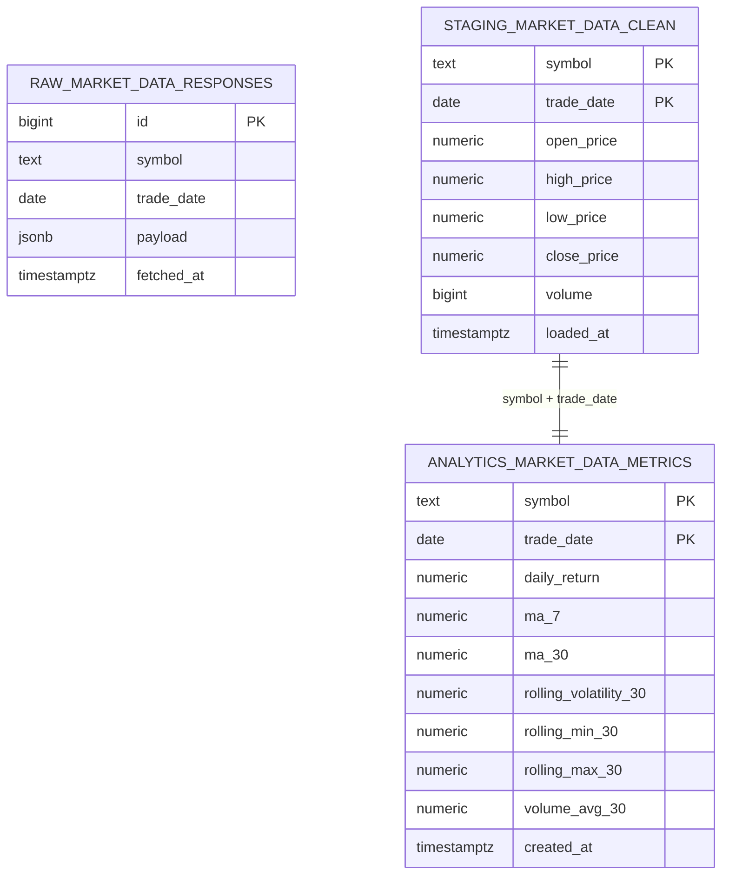

# ERD

```mermaid
erDiagram
    RAW_MARKET_DATA_RESPONSES {
        bigint id PK
        text symbol
        date trade_date
        jsonb payload
        timestamptz fetched_at
    }

    STAGING_MARKET_DATA_CLEAN {
        text symbol PK
        date trade_date PK
        numeric open_price
        numeric high_price
        numeric low_price
        numeric close_price
        bigint volume
        timestamptz loaded_at
    }

    ANALYTICS_MARKET_DATA_METRICS {
        text symbol PK
        date trade_date PK
        numeric daily_return
        numeric ma_7
        numeric ma_30
        numeric rolling_volatility_30
        numeric rolling_min_30
        numeric rolling_max_30
        numeric volume_avg_30
        timestamptz created_at
    }

    STAGING_MARKET_DATA_CLEAN ||--|| ANALYTICS_MARKET_DATA_METRICS : "symbol + trade_date"
```
